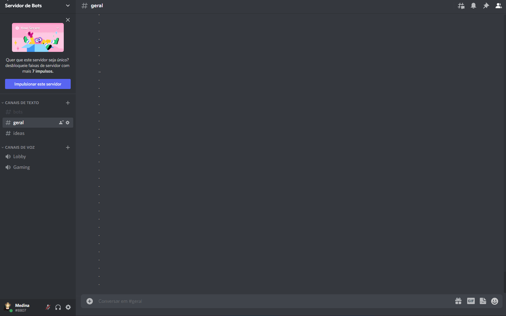

# Anime Season - Bot

Olá, como vão manitos?
Este que presenciam em sua frente, é um fruto de minha preguiça pessoal de ficar procurando quais animes irão ser lançados em cada temporada (Sim, sou um otaku fedido), por conta disso, juntei o útil ao agradável e criei o "Anime Season", o objetivo do mesmo é listar todos os animes que irão ter em cada temporada conforme o ano informado pelo usuário.

## Guia rápido do "Anime Season"

Para utilizar o bot, é necessário conhecer os seguintes comandos:
|    Comando     |Ação                           
|----------------|-------------------------------
|!news [temporada] [ano] [pagina] | `"Deve listar todos os animes encontrados"`|            

## Demonstração
